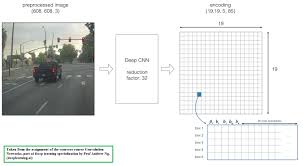
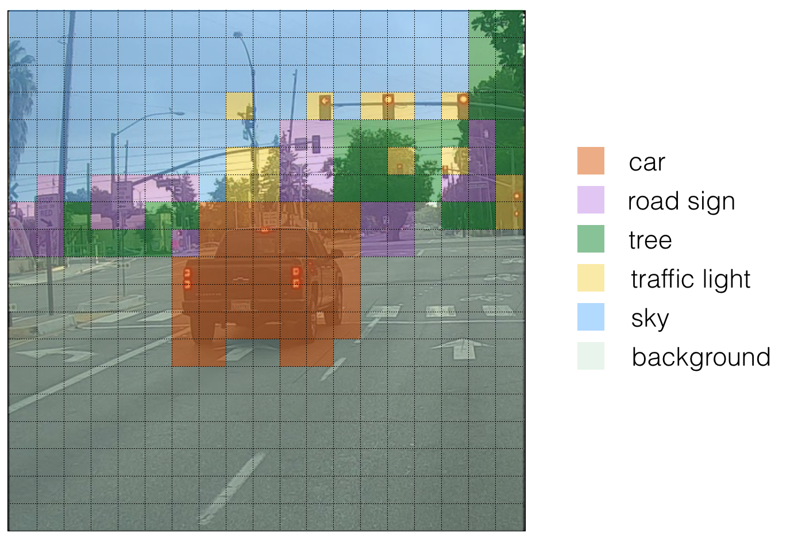

# Autonomous driving and object detection using YOLO algorithm
## YOLO
"You Only Look Once" (YOLO) is a popular algorithm because it achieves high accuracy while also being able to run in real-time. This algorithm "only looks once" at the image in the sense that it requires only one forward propagation pass through the network to make predictions. After non-max suppression, it then outputs recognized objects together with the bounding boxes.
### Model Details
Inputs and outputs:
- The input is a batch of images, and each image has the shape (m, 608, 608, 3)
- The output is a list of bounding boxes along with the recognized classes. Each bounding box is represented by 6 numbers  (pc,bx,by,bh,bw,c)  as explained above. If you expand  c  into an 80-dimensional vector, each bounding box is then represented by 85 numbers.

Anchor Boxes:
- Anchor boxes are chosen by exploring the training data to choose reasonable height/width ratios that represent the different classes. For this assignment, 5 anchor boxes were chosen for you (to cover the 80 classes), and stored in the file './model_data/yolo_anchors.txt'
- The dimension for anchor boxes is the second to last dimension in the encoding:  (m,nH,nW,anchors,classes) .
- The YOLO architecture is: IMAGE (m, 608, 608, 3) -> DEEP CNN -> ENCODING (m, 19, 19, 5, 85).

Encoding:
If the center/midpoint of an object falls into a grid cell, that grid cell is responsible for detecting that object. Since we are using 5 anchor boxes, each of the 19 x19 cells thus encodes information about 5 boxes. Anchor boxes are defined only by their width and height.

For simplicity, we will flatten the last two last dimensions of the shape (19, 19, 5, 85) encoding. So the output of the Deep CNN is (19, 19, 425).

Now, for each box (of each cell) we will compute the following element-wise product and extract a probability that the box contains a certain class.
The class score is  scorec,i=pc×ci : the probability that there is an object  pc  times the probability that the object is a certain class  ci .

- In the above figure, let's say for box 1 (cell 1), the probability that an object exists is  p1=0.60 . So there's a 60% chance that an object exists in box 1 (cell 1).
- The probability that the object is the class "category 3 (a car)" is  c3=0.73 .
- The score for box 1 and for category "3" is  score1,3=0.60×0.73=0.44 .
- Let's say we calculate the score for all 80 classes in box 1, and find that the score for the car class (class 3) is the maximum. So we'll assign the score 0.44 and class "3" to this box "1".

Visualizing classes:
Here's one way to visualize what YOLO is predicting on an image:

For each of the 19x19 grid cells, find the maximum of the probability scores (taking a max across the 80 classes, one maximum for each of the 5 anchor boxes).
Color that grid cell according to what object that grid cell considers the most likely.

Doing this results in the picture below

In the figure above, we plotted only boxes for which the model had assigned a high probability, but this is still too many boxes. We'd like to reduce the algorithm's output to a much smaller number of detected objects.

To do so, we'll use non-max suppression. Specifically, we'll carry out these steps:

- Get rid of boxes with a low score (meaning, the box is not very confident about detecting a class; either due to the low probability of any object, or low probability of this particular class).
- Select only one box when several boxes overlap with each other and detect the same object.

### Filtering with a thresold on class scores
W are going to first apply a filter by thresholding. We would like to get rid of any box for which the class "score" is less than a chosen threshold.

The model gives us a total of 19x19x5x85 numbers, with each box described by 85 numbers. It is convenient to rearrange the (19,19,5,85) (or (19,19,425)) dimensional tensor into the following variables:

- ` box_confidence `: tensor of shape  (19×19,5,1)  containing  pc  (confidence probability that there's some object) for each of the 5 boxes predicted in each of the 19x19 cells.

- ` boxes `: tensor of shape  (19×19,5,4)  containing the midpoint and dimensions  (bx,by,bh,bw)  for each of the 5 boxes in each cell.

- ` box_class_probs `: tensor of shape  (19×19,5,80)  containing the "class probabilities"  (c1,c2,...c80)  for each of the 80 classes for each of the 5 boxes per cell.

### Summary for YOLO
- Input image (608, 608, 3)
- The input image goes through a CNN, resulting in a (19,19,5,85) dimensional output.
- After flattening the last two dimensions, the output is a volume of shape (19, 19, 425):
1. Each cell in a 19x19 grid over the input image gives 425 numbers.
2. 425 = 5 x 85 because each cell contains predictions for 5 boxes, corresponding to 5 anchor boxes, as seen in lecture.
3. 85 = 5 + 80 where 5 is because $(p_c, b_x, b_y, b_h, b_w)$ has 5 numbers, and 80 is the number of classes we'd like to detect
- You then select only few boxes based on:
1. Score-thresholding: throw away boxes that have detected a class with a score less than the threshold
2. Non-max suppression: Compute the Intersection over Union and avoid selecting overlapping boxes
- This gives you YOLO's final output.
